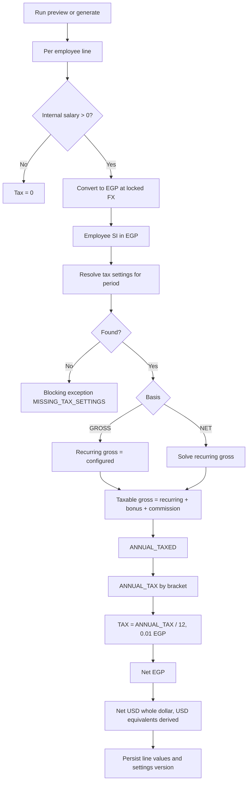

# HRFlow Payroll - Income Tax Calculation Spec

**Branch:** `feature/payroll-deductions`
**Status:** Agreed requirements (owner-approved in Project discussion, September 29, 2026). Not implemented. Income tax is currently a 0.00 stub in `be/finance/services/payroll_calculation_helper.py`.
**Decision reference:** D-009 in `docs/project-context/04-decision-log.md`.
**Rule authority:** The owner's Excel formula, used verbatim. No rule changes.

## 1. Rules

Scope: internal salary lines only (external lines are never taxed). All math is in EGP after conversion with the locked FX rate. Only the final net is converted back to USD (whole-dollar payment, as today). All `*_usd_equivalent` fields are derived display values and never feed the calculation.

Steps per internal line:
1. Compute employee SI in EGP (existing logic, unchanged). Uninsured: SI = 0.
2. Recurring gross: configured gross (GROSS basis) or solved from target net (NET basis, section 4).
3. Taxable gross = recurring gross + bonus + commission (EGP).
4. `ANNUAL_TAXED = (taxable gross - employee SI) x 12 - TAX_LIMIT_P`.
5. `ANNUAL_TAX` from the bracket table (unrounded Decimal).
6. `TAX = ANNUAL_TAX / 12`, rounded to 0.01 EGP.
7. Net EGP = taxable gross - employee SI - TAX. Convert to USD at the end.

## 2. Bracket table (equivalent to the Excel nesting)

`ANNUAL_TAX = rate x (Y - base) + fixed`; first row where `Y <= upper` (inclusive). `Y <= 0` gives 0.

| Upper (inclusive) | Rate | Base | Fixed |
|---|---|---|---|
| 40,000 | - | - | 0 |
| 55,000 | 10% | 40,000 | 0 |
| 70,000 | 15% | 55,000 | 1,500 |
| 200,000 | 20% | 70,000 | 3,750 |
| 400,000 | 22.5% | 200,000 | 31,750 |
| 600,000 | 25% | 400,000 | 76,750 |
| 700,000 | 25% | 400,000 | 79,750 |
| 800,000 | 25% | 400,000 | 82,000 |
| 900,000 | 25% | 400,000 | 85,000 |
| 1,200,000 | 25% | 400,000 | 90,000 |
| above 1,200,000 | 27.5% | 1,200,000 | 300,000 |

Fixed = sum of the Excel constants per branch. The table is the default template offered by the settings screen.

Property: tax jumps upward at 200k, 600k, 700k, 800k, 900k and 1.2M, so net is not strictly increasing in gross. Every target net has at least one solution, but some have several.

## 3. Flow

## 4. NET solver

SI does not depend on gross, so tax is the only unknown. For target net N, limit L, SI, and each band (rate r, base b, fixed F) in ascending order:

`Y = (12N - L - r*b + F) / (1 - r)`; band 0 uses `Y = 12N - L`.

Accept the first band where Y lies inside that band's range (lowest valid gross wins). Then `G = (Y + L)/12 + SI`, rounded to 0.01 EGP. Self-check: the forward function on G must return N within one cent. Bonus and commission are added afterwards as taxable gross and taxed with the forward function.

## 5. Settings

- New effective-dated table for `TAX_LIMIT_P` and the bracket schedule (migration required; no backfill; testing mode).
- Edited from the payroll settings screen, similar to SI rates (`PayrollSettingsDB`, `update_payroll_settings`). Audit-logged.
- No seed value. Until an admin saves a version, the blocking exception `MISSING_TAX_SETTINGS` applies when any internal line exists.
- `effective_from` must be the first day of a month. A run uses the newest version with `effective_from` on or before the first day of the payroll month. The version id is stored on the run.
- Access: `system_admin` only, enforced in the backend router (new read/write permission keys seeded to `system_admin`). No read access for other payroll users.
- A persisted run keeps its stored settings and is never silently recalculated; preview recalculates freely.

## 6. Persistence and outputs

- Nullable snapshot column on payroll lines: taxable gross, employee SI, annual taxed, annual tax, settings version id.
- `employee_tax_egp`, `employee_tax_usd_equivalent`, `total_employee_tax_egp` populated from the calculation.
- `deductions_total_usd` and `employer_cost_extra_usd` include tax as EGP amounts converted to USD; they are derived and never feed the net.
- Exports and payslips carry tax in its own column (D-007: one row per employee).
- Screen 6 continues to record obligations manually (D-008): estimate, actual and variance stay separate. No "estimate" label is required in the UI.

## 7. UI

- Option A now: keep the existing TAX column; intermediates are not shown.

## 8. Deferred: per-line breakdown drawer (later change phase)

Start from the stored line snapshot fields (section 6). A row-click drawer would show taxable gross, SI, annual taxed, annual tax and monthly tax. It needs no new backend calculation; it only reads the snapshot. Do not add intermediates as table columns unless the owner changes this decision.

## 9. Known consequences

- The x12 annualization means a one-off bonus month is taxed as if income repeated for a year; there is no year-to-date true-up.
- EGP tax and SI are rounded to 0.01; the USD payment is whole-dollar, so USD figures may not add back exactly.
- Doc 11's "no new migrations" constraint is superseded for this feature by D-009.

## 10. Acceptance tests

- Boundaries: Y = 0, 40,000, 40,001, 55,000, 70,000, 200,000, 400,000, 600,000, 700,000, 800,000, 900,000, 1,200,000, 1,200,001.
- Parity with the owner's Excel for at least 20 salaries, including EETAX-verified ones.
- NET round trip across targets that straddle a jump.
- GROSS and NET with bonus and commission; uninsured employees; external-only employees (tax 0); missing settings.
